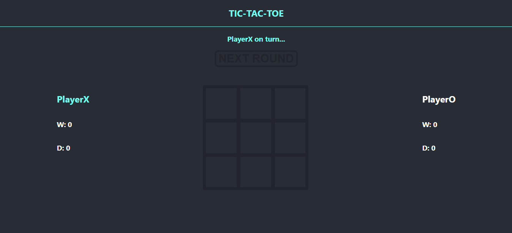
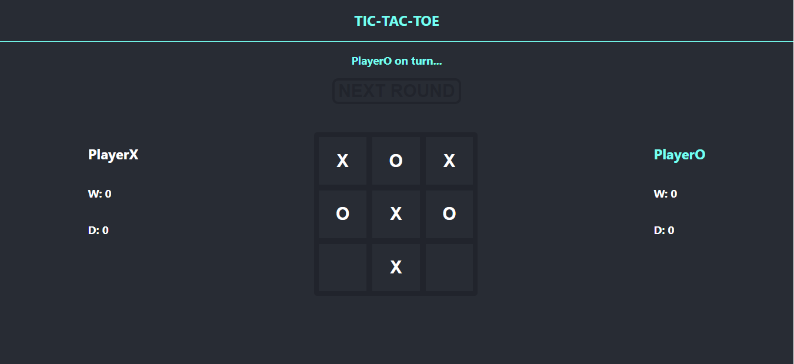
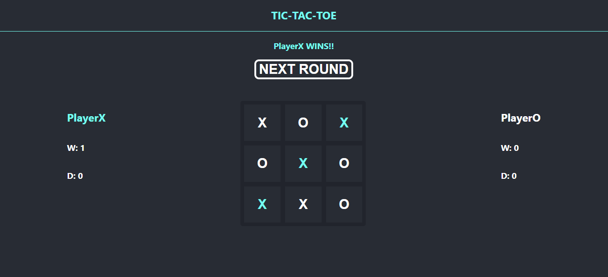
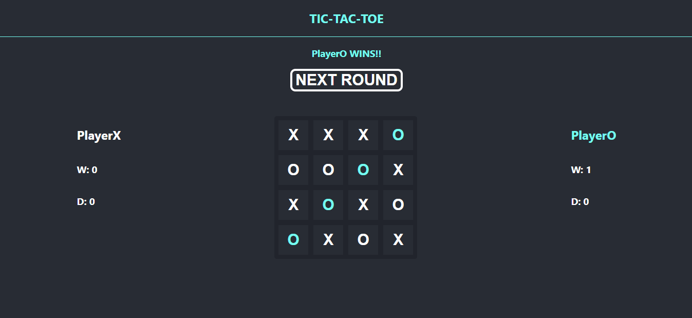
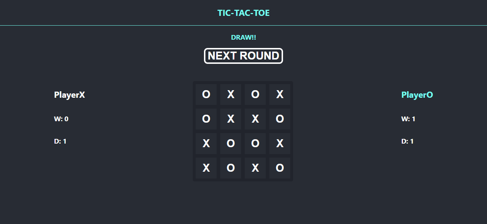

# TIC-TAC-TOE

## Let's play!

### X is always first ...

### O has it's turn ...

### But X wins ...

### This time O wins on bigger board !

### Bigger board same rules !

### Draw can also be end result :)

