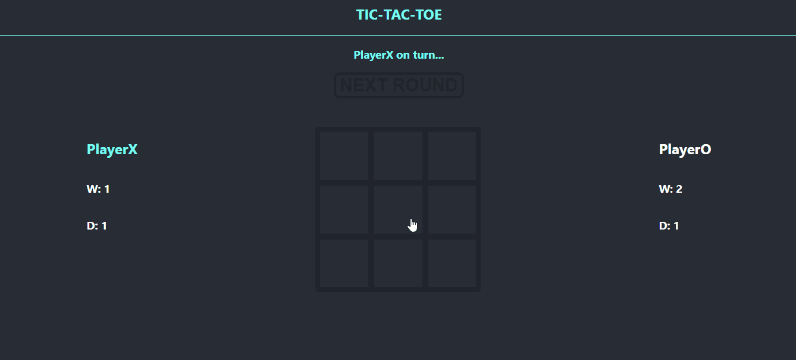
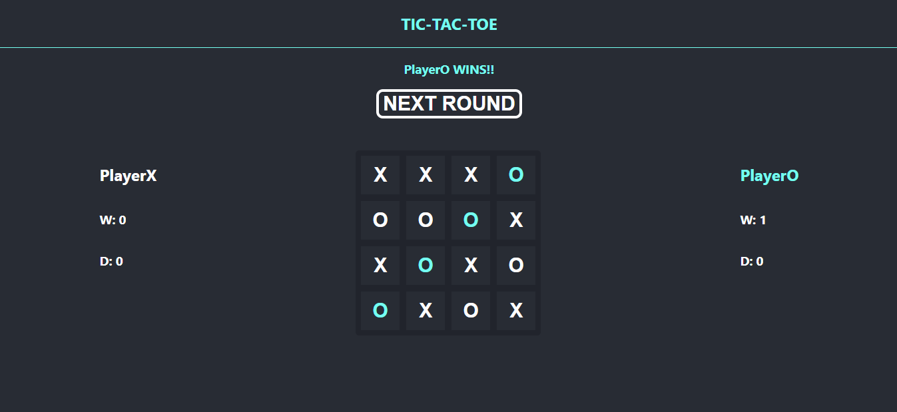
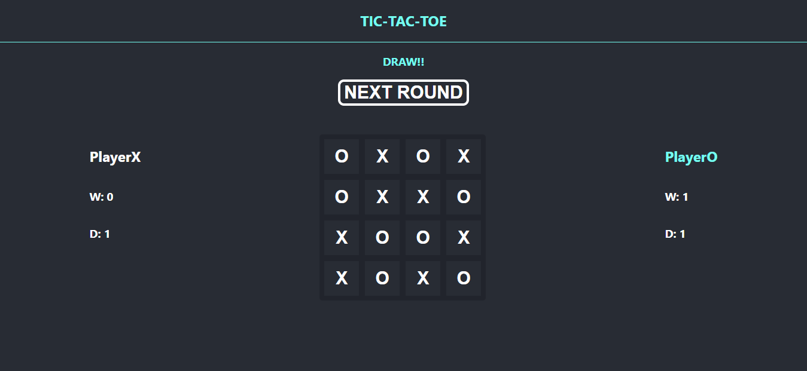

# TIC-TAC-TOE

## Let's play!

### X has its turn ...

### O has its turn ...

### But X wins ...

### This time O wins on the bigger board!

### Bigger board but same rules!

### Draw can also be the end result :)

### git clone & npm install & npm run & ENJOY ;)
